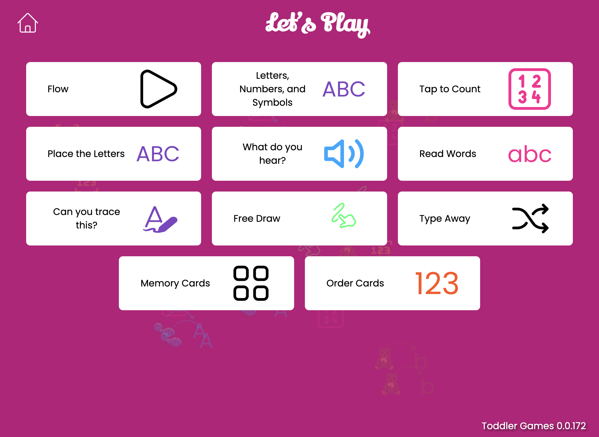

# Toddler Games

This codebase represents a collection of educational games for toddlers called "Toddler Games". It's a React-based web application that includes several interactive games designed to help toddlers learn various concepts.

Demo: [https://mykeels.github.io/toddler-games/](https://mykeels.github.io/toddler-games/)

[](https://mykeels.github.io/toddler-games/)

Here's some games included:

- [Find and Tap](./src/games/FindAndTap/README.md): A game where toddlers identify and tap on specific letters, numbers, or objects on the screen.

- [Tap to Count](./src/games/TapToCount/README.md): An interactive game that presents various objects for toddlers to count by tapping, helping them learn numbers and basic addition.

- [Free Draw](./src/games/FreeDraw/README.md): A game where toddlers can draw with different colors. The colors change every 5 seconds.

- [Number Keypad](./src/games/NumberKeypad/README.md): A game where toddlers can tap on the numbers 0-10 to hear the corresponding number.

- [Letter Keypad](./src/games/LetterKeypad/README.md): A game where toddlers can tap on the letters A-Z to hear the corresponding letter.

- [Match Image to Letter](./src/games/ImageToLetterMatching/README.md): An interactive game that helps toddlers identify letters by matching them with the corresponding image.

- [Letter Tracing](./src/games/LetterTracing/README.md): An interactive game that helps toddlers practice writing letters by tracing them on the screen with their finger or a stylus.

- [Read Words](./src/games/ReadWords/README.md): A game where toddlers read words by tapping on the corresponding letter, helping them learn to associate letters with sounds.

- A for apple

Pick a letter at random.
Sound out "[letter] for ..."
Show two cards with objects. One with an object that starts with the letter, and another with an object that does not.
Tap on the correct card.

- Number Sort

Show n numbers. Allow the toddler to drag them to the correct order.

- Letter Sort

Show n letters. Allow the toddler to drag them to the correct order.

- Add Digits

Show two digits. Each digit has a number of circles below it representing its cardinality.

Tap on the first digit, highlighting the circles with each tap.

Tap on the second digit, highlighting the circles with each tap.

Tap on the result card, highlighting the circles with each tap.

<!-- - [Number Matching](./src/games/NumberMatching/README.md): A game where toddlers match numbers with the corresponding quantity of objects, reinforcing number recognition and counting skills. -->

<!-- - [Phonics Flashcards](./src/games/PhonicsFlashcards/README.md): Digital flashcards that display letters or simple words, encouraging toddlers to practice phonics by sounding out the letters and words.

- [Rhyming Words](./src/games/RhymingWords/README.md): A game that introduces toddlers to rhyming by presenting a word and asking them to choose the picture that rhymes with it from a set of options.

- [Alphabet Puzzle](./src/games/AlphabetPuzzle/README.md): A digital puzzle game where toddlers drag and drop letter pieces to complete the alphabet, enhancing letter recognition and order.

- [Story Time](./src/games/StoryTime/README.md): A simple, interactive storybook app that highlights words as they are read aloud, encouraging toddlers to follow along and associate written words with their spoken counterparts. -->

## Using the template

This template provides a minimal setup to get React working in Vite with HMR and some ESLint rules.

Currently, two official plugins are available:

- [@vitejs/plugin-react](https://github.com/vitejs/vite-plugin-react/blob/main/packages/plugin-react/README.md) uses [Babel](https://babeljs.io/) for Fast Refresh
- [@vitejs/plugin-react-swc](https://github.com/vitejs/vite-plugin-react-swc) uses [SWC](https://swc.rs/) for Fast Refresh

## Expanding the ESLint configuration

If you are developing a production application, we recommend updating the configuration to enable type aware lint rules:

- Configure the top-level `parserOptions` property like this:

```js
export default tseslint.config({
  languageOptions: {
    // other options...
    parserOptions: {
      project: ['./tsconfig.node.json', './tsconfig.app.json'],
      tsconfigRootDir: import.meta.dirname,
    },
  },
});
```

- Replace `tseslint.configs.recommended` to `tseslint.configs.recommendedTypeChecked` or `tseslint.configs.strictTypeChecked`
- Optionally add `...tseslint.configs.stylisticTypeChecked`
- Install [eslint-plugin-react](https://github.com/jsx-eslint/eslint-plugin-react) and update the config:

```js
// eslint.config.js
import react from 'eslint-plugin-react';

export default tseslint.config({
  // Set the react version
  settings: { react: { version: '18.3' } },
  plugins: {
    // Add the react plugin
    react,
  },
  rules: {
    // other rules...
    // Enable its recommended rules
    ...react.configs.recommended.rules,
    ...react.configs['jsx-runtime'].rules,
  },
});
```
