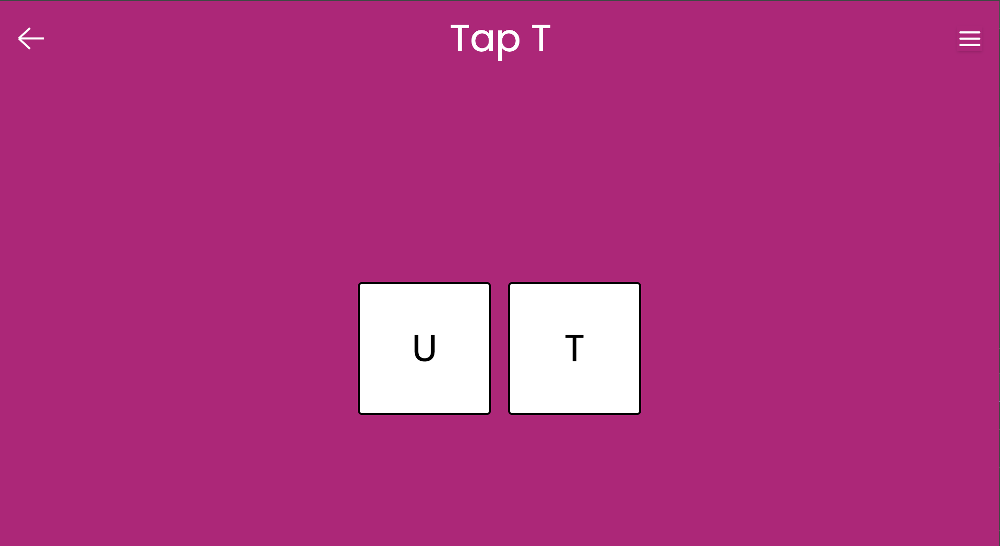
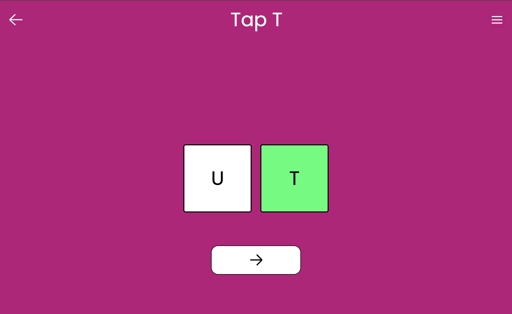

## Find and Tap

A game where toddlers find and tap on the correct card.

## Gameplay

Display a pair of cards. Each card has a letter or number.

Verbally ask the toddler to tap on the card with the letter "A" or the card with the number "1".

If they tap on the correct card, cheer.

If they tap on the incorrect card, let them try again.