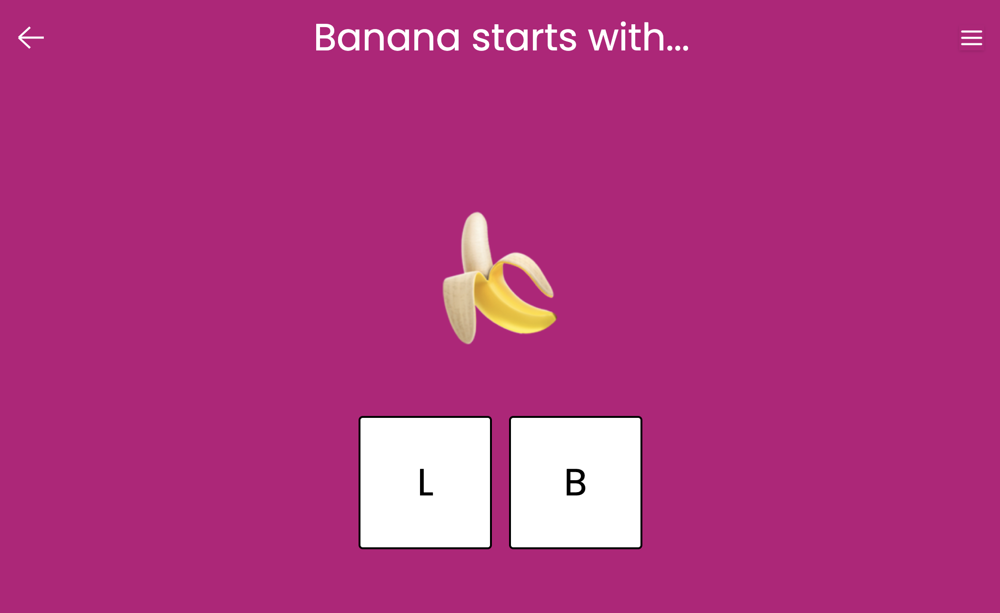
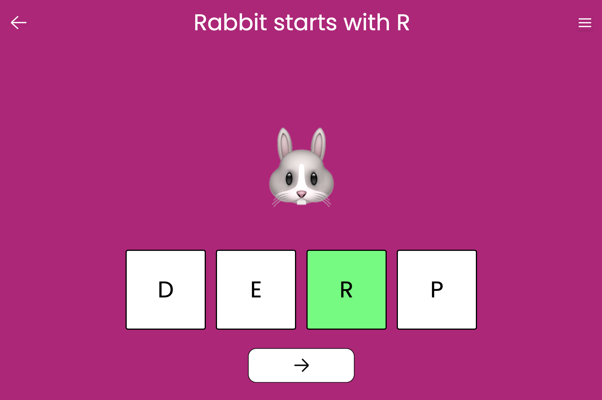

# Image to Letter Matching

An interactive game that helps toddlers identify letters by matching them with the corresponding image.

## Gameplay

- We will show an image e.g. a Dog.
- We will show letters options e.g. B and D.
- The toddler must tap the correct letter that matches the image.
- When correct, the letter will be highlighted in green.
- When incorrect, the letter will be highlighted in red.
- The word describing the image will be shown at the top of the screen.