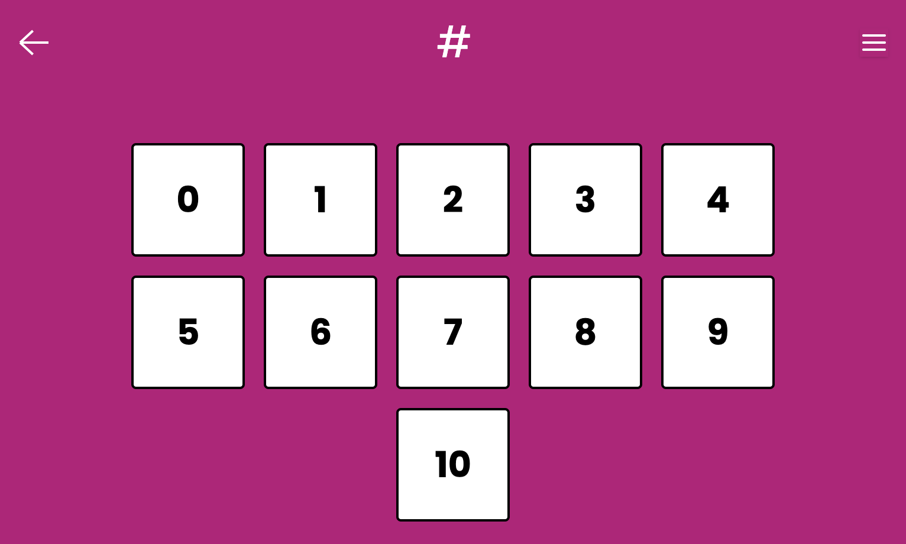

# Number Keypad

A number keypad interface that plays a phonics sound for each number when you tap it.

## Gameplay

- Show a number keypad.
- The toddler taps on the number they want to hear the sound for.
- The corresponding sound will play.
