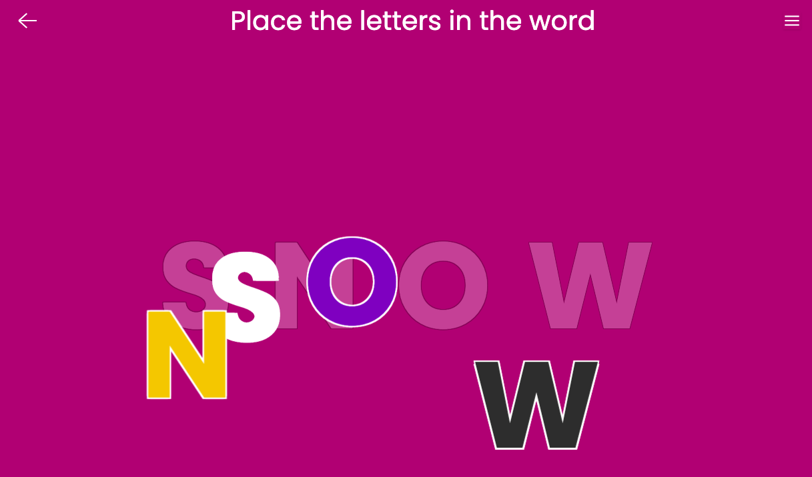
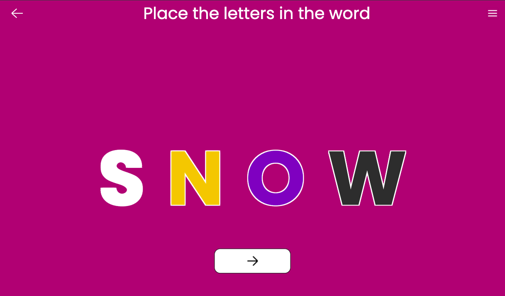

# Place the Letters

A game where toddlers place letters in the correct order to spell a word.

## Gameplay

Display a word with letter slots, and a set of letters that can be used to fill the slots.

Ask the toddler to place the letters in the correct order to spell the word.