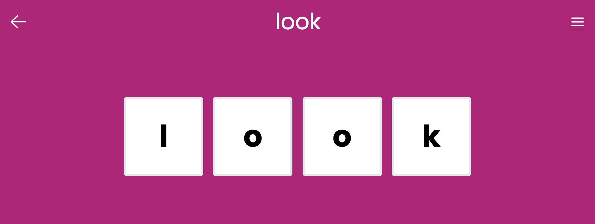
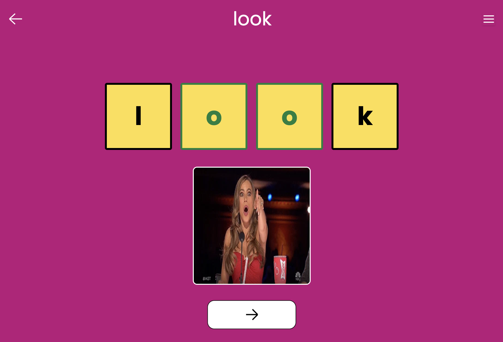

# Read Words

A game where toddlers read words by tapping on the corresponding letter, helping them learn to associate letters with sounds.

E.g. a word like "look" would have the letters "l", "o", and "o", "k" shown as tappable tiles.

The toddler can tap on the letters from left to right to hear each phonetic sound.

A descriptive image of the word is shown after the toddler has read the word correctly, because pictures are worth a thousand words.

Consecutive letters that sound the same are highlighted as a group.