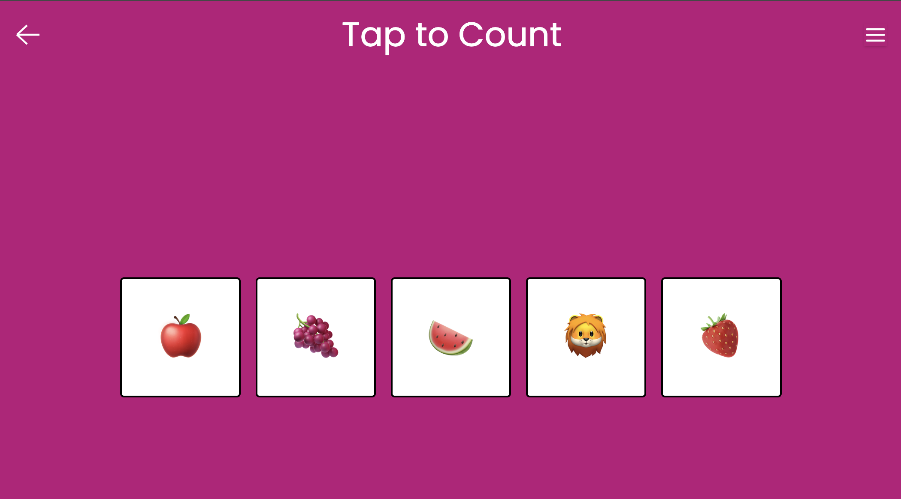
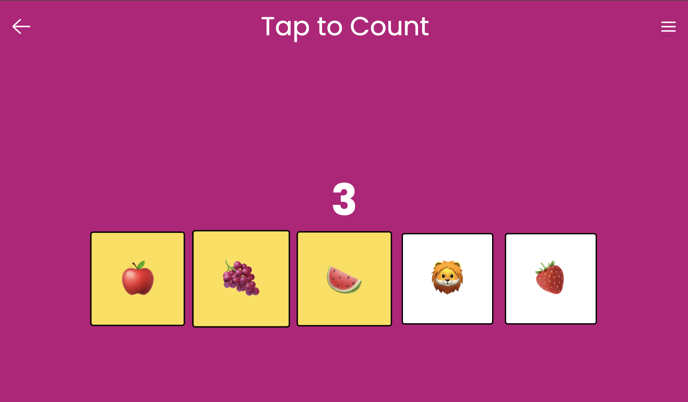
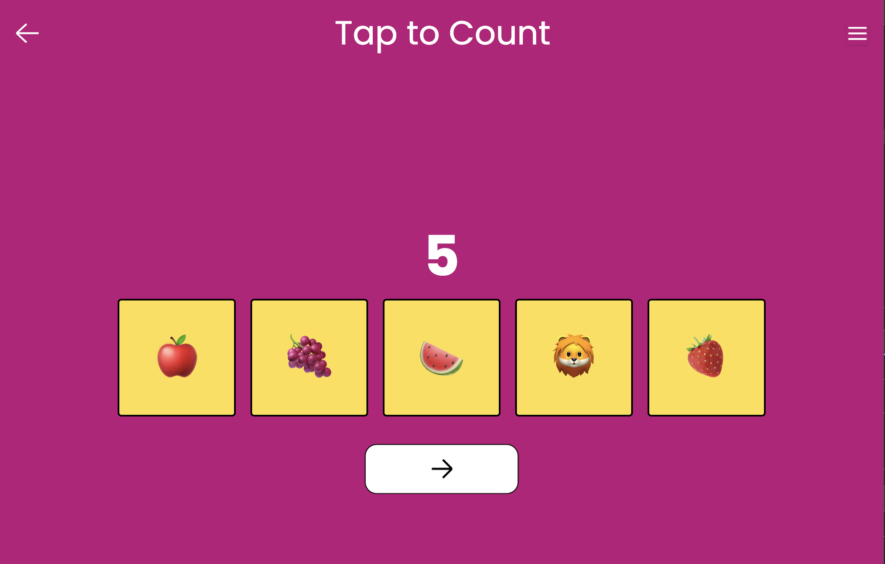

# Tap to Count

An interactive game that presents various objects for toddlers to count by tapping, helping them learn numbers and basic addition.

## Gameplay

1. The game will display a number of objects on the screen.
2. Tap the screen to count the objects.
3. The number of objects will be displayed as you tap.
